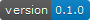

<!-- README.md is generated from README.Rmd. Please edit that file -->

```{r, include = FALSE}
# Set some variables for the info badges
status <- "development-orange"
pkg_version <- paste(pkgload::pkg_version(), collapse = ".")

# Get badges based on variables (converted to png because Azure Devops doesn't render SVG)
download.file(url = paste0("https://img.shields.io/badge/version-", pkg_version, "-blue.svg"),
              destfile = "inst/static/pkg-version-badge.svg")
rsvg::rsvg_png(svg = "inst/static/pkg-version-badge.svg",
               file = "inst/static/pkg-version-badge.png")

download.file(url = paste0("https://img.shields.io/badge/status-", status, ".svg"),
              destfile = "inst/static/app-status-badge.svg")
rsvg::rsvg_png(svg = "inst/static/app-status-badge.svg",
               file = "inst/static/app-status-badge.png")
```

# advancedShiny

<!-- badges: start -->


<!-- badges: end -->

The goal of advancedShiny is to provide an R Shiny application which can showcase some intermediate & advanced R Shiny techniques to DfE colleagues at Coffee & Coding sessions.

## Installation

You can install advancedShiny from [GitHub](https://github.com/chrisbrownlie/advancedShiny) with:

``` r
# install.packages("devtools")
devtools::install_github("chrisbrownlie/advancedShiny")
```
## Usage

The app can be run with the following command:

```{r eval=FALSE}
advancedShiny::run_IAS_app()
```

# More info
See TODO.md for a more detailed plan and structure of what the app will contain or contact [Chris Brownlie](mailto:chris.brownlie@hotmail.co.uk) for more information.
