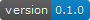

<!-- README.md is generated from README.Rmd. Please edit that file -->

# advancedShiny

<!-- badges: start -->

  <!-- badges: end -->

The goal of advancedShiny is to provide an R Shiny application which can
showcase some intermediate & advanced R Shiny techniques to DfE
colleagues at Coffee & Coding sessions.

## Installation

You can install advancedShiny from
[GitHub](https://github.com/chrisbrownlie/advancedShiny) with:

``` r
# install.packages("devtools")
devtools::install_github("chrisbrownlie/advancedShiny")
```

## Usage

The app can be run with the following command:

``` r
library(advancedShiny)
run_IAS_app()
```

# More info

See TODO.md for a more detailed plan and structure of what the app will
contain or contact [Chris Brownlie](mailto:chris.brownlie@hotmail.co.uk)
for more information.
